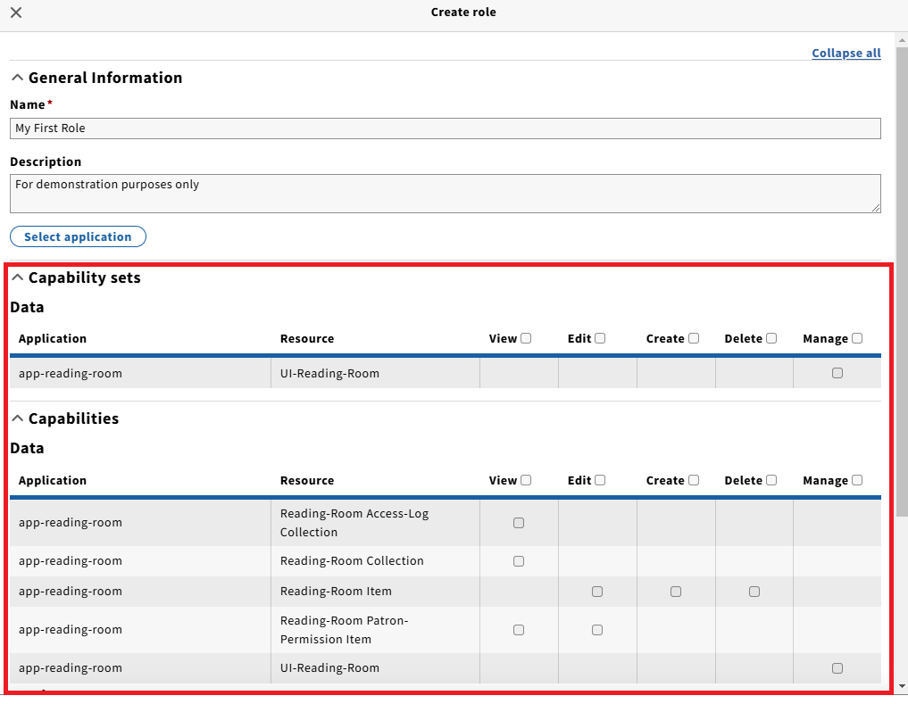

FOLIO has a user permissions system that allows for granular control over what users can access in their FOLIO installation.

Each app defines its own permissions for the frontend and backend modules that it uses.

By default, a FOLIO installation does not provide roles or permission profiles for library staff. Instead, FOLIO administrators can build their own groups of permissions called permission sets that correspond to their local needs. They can then assign those permissions to users through the Users app.

## Managing Roles with Eureka

## Overview
The new Eureka platform, which FOLIO is adopting with the Sunflower release, replaces the permission-based access control model with a roles-based permission model. This page
explains how to manage roles and their assignments. Information on migrating permissions from the Okapi platform to Eureka can be found at the bottom of the page. 

## Terminology 

- Permission 
	- A permission is an object in FOLIO that can be used to control access to FOLIO apps, workflows, and data
	- A permission can have a number of different attributes, depending on whether you are viewing the permission in FOLIO's code or whether you are looking at permissions for a user on a FOLIO tenant
	 
- Permission set
	- A permission with one or more subpermissions 
	- Can be nested infinitely 

- Resource
	- Something in FOLIO on which users can perform operations, e.g. orders, instances, etc.

- Action
	- An operation that manipulates a resource, e.g. create, edit, view, delete, execute, etc.

- Capabilities 
	- Capabilities define the ability to perform an **action** on a FOLIO **resource**, e.g. Edit (action) on Instances (resource)
	- Derived from information in permissions module descriptors 
	- Capabilities are managed by the system. Users and admins cannot create or remove capabilities. Instead, they're created in applications that are enabled for tenants 
	- They maintain a reference to the *permission* from which they were created
	- They maintain a reference to the *application* which provides them 

- Capability sets
	- Capability sets are comprised of **capabilities**
	- Derived from information in module descriptors (Permission sets) 
	- Are managed by the system. Users and admins cannot create or remove capability sets. Instead, they're created in applications that are enabled for tenants
	- Maintain a reference to the *permission* from which they were created
	- Maintain a reference to the *application* which provides them

- Roles
	- Comprised of capabilities and/or capability sets
	- Created/managed by administrators, not the system
	- Cannot be nested. Roles are flat
	- Are reusable 

- Default roles
	- Roles provided by the system, optionally loaded during tenant entitlement 

- Policies 
	- Provides greater control over who can do what, when, and from where. For example, policies could be created to only allow users to perform check-in/check-out operations during normal business hours from certain locations
	- Policies are associated with capabilities 
	- Time-based policies are managed by administrators, not by the system 

- AuthUser
	- Refers to a user record in [Keycloak](https://github.com/folio-org/folio-keycloak)
	- AuthUsers are managed by FOLIO. No direct interaction with Keycloak is required
	- AuthUsers are a subset of Users, which include staff, patrons, administrators, etc. 
	- A user becomes an AuthUser if they are assigned credentials, roles, or capabilities. The Keycloak user record is only needed for those who log in and use FOLIO. There is no need for Keycloak to know about patrons and others who are just data in the system 

**How do these relate to one another?** 
This diagram may help you visualize the relationships between some of these terms: 

## Role Creation
Role creation happens in the "**Authorization Roles**" section of **Settings**. Use the "**+New**" button to open the form for creating a role. 

Provide a name and description, then use the "**Select application**" button to open the selection modal. The purpose of selecting applications is to specify the functional areas which provide capabilities and capability sets you want to add to the role. Only Capabilities and Capability Sets provided by the selected application(s) will be shown. 

After selecting one or more applications and clicking "**Save and close**," the Capability and Capability Set portions of the role creation form will be populated, and you can select those which you want to include in your role by checking individual boxes or the boxes in the column headers. 

#### Notes on selecting Capabilities and Capability Sets: 
* Capabilities and Capability Sets are divided into 3 groups: **Data**, **Settings**, and **Procedural**. These are intended to make it easier to sort through the options. Here are brief descriptions of each set: 
	*<u>Data</u>: Capablities for directly managing resources as they exist in FOLIO (i.e. RESTful APIs)
		*E.g. "Instance," "purchase order lines," etc. 
	*<u>Procedural</u>: Capabilities for initiating and controlling processes in FOLIO (i.e. execution of tasks)
		*E.g. "Check-out-by-barcode" 
	*<u>Settings</u>: Administrative Capabilities for managing FOLIO configurations 
		*E.g. "Notes settings" 
* Selecting a Capability Set will result in the automatic selection of its constituent capabilities. You cannot unselect individual capabilities which were automatically checked
* ***Tip:*** Using "find on page" (e.g. `Ctrl+F` / `Cmnd+F`) can be helpful when searching for capabilities
* Don't forget to click "**Save & close**" when you've made your selections

## Role Modification
Making adjustments to roles is very similar to creating new roles. Start by selecting the name of the desired role. This will result in a detail pane to be displayed. 

***Tip***: the search bar can help you find what you're looking for. 

Use the "**Actions**" menu in the role details pane to edit the role. 

The role edit form looks and behaves the same as the role creation form. Refer to the Role Creation section for details.  

## Role Deletion 
Deletion of a role is similar to role modification. Refer to the Role Modification section for details. When delting a role, instead of selecting "**Edit**" from the "**Actions**" menu, select "**Delete**." Exercise caution when deleting roles: **deleting a role cannot be undone.** When deleting a role which is assigned to users, the role assignments will automatically be removed from those users. If you are sure you wish to delete the role, you will be asked to confirm. 

## Role Duplication 
Duplication of a role can be accomplished by following similar steps as role modification. Refer to the Role Modification section for details. However, instead of selecting "**Edit**" from the "**Actions**" menu, select "**Duplicate**." You will be asked to confirm. A system generated name will be given to the duplicate role. Role assignments will not be copied to the new role. 

After confirming you will automatically be taken to the new/duplicate role. 

## Shared Roles
Shared roles are centrally managed in that they can only be edited in the consortia manager. A shared role will appear as a Role in all tenants with the same capabilities. User from the given tenant can be assigned to that role. Editing that role in the central tenant will change it for all tenants. 

To share a role users must have permissions to access the consortia manager app and share data. With your active affiliation set to the systems central tenant. Navigate to Consortia manager -> Authorization Roles. 

* Select the central tenant from the Member dropdown at the top of the second pane 
* Choose a Role that you have created in the central tenant 
* Click the actions menu
* Click "Share to all" 

* When the confirmation modal appears click "Submit" to confirm and share the role with all tenants in the system 
* You will see a success toast message 
* In the view pane for the role you will now see "Centrally managed" = Yes 

## Managing Role Assignments
Role assignments can be maanged from a few different places. Which place is most appropriate depends on what you're trying to accomplish. 

* From Settings -> Authorization Roles
	* This is a good choice when assigning or unassigning multiple users to/from a given role 
* From the Users app
	* This is a good choice when managing role assignments for a given user
* From Consortia manager -> Authorization Roles (only applicable to consortia with ECS enabled) 
	* From here you can manage role assignments across all related tenants 
	* From here you can also create "Shared" roles that can be used by all tenants in the system  

### Settings / Authorization Roles 
To manage role assignments in the context of a particular role, navigate to the "**Authorization Roles**" section of **Settings**. Start by selecting the name of the desired role. This will result in a detail pane to be displayed. 

***Tip:*** the search bar can help you find what you're looking for.

Once you have selected a role, an additional pane will open showing the details of that role. This role detail pane will include on "**Assigned users**" accordion (which should be expanded by default). 

Clicking on the "**Assign/Unassign**" button will open the "**Select User**" modal. Use the facets and search functions to help find the user(s) you want to assign or unassign. 

To assign a user to the role, check the box in the first column. To unassign a user from the role, uncheck that box. When finished, click "**Save.**"

In some cases you may see a dialogue asking you to confirm the creation of user records in Keycloak. The creation of these records is necessary for the role assignment to succeed. Click "**Confirm**" to proceed, or "**Cancel**" if you're unsure. 

Upon completion, you will land back at the role detail view. If the assignment (for unassignment) was successful, you should see a green message indicating the success at the bottom of your screen. The "**Assigned users**" accordion should be updated to reflect the changes you've just made. 

### Users App
To manage role assignments in the context of a particular user, navigate to the "**Users**" app. Use the facets and search functions to help find the user you want to assign to roles. 

Select a user to display that user's details in a separate pane. Here yo uwill see a "User roles" accordion (collapsed by default). When collapsed, a bubble in the accordion header indicates how many roles the user is presently assigned to. While this accordion is helpful for viewing a user's role assignments, you cannot edit a user's role assignments here. Instead, you must select the "**Edit**" option from the "**Action**" menu. 

On the Edit form, scroll down to and click on the "User roles" accordion to expand it. Here you will see the list of roles this user is assigned to. You can click the "X" icon for a given role to unassign that role. You also have the option to unassign all user roles and add user roles via the buttons below the list or roles. 

When using "Unassign all users roles," you will be prompted to confirm. The roles being removed will be listed in the dialogue box. 

When using "Add user roles," the "Select user roles" modal will be displayed. Use the facets and search functions to help find the role(s) you want to assign to the user. Check the boxes next to the roles you want to assign (or uncheck the roles you want to unassign). When finished, click "**Save & close**" to submit your changes. 

Finally, in order for any of the changes you've made to be saved, you must click the "**Save & close**" button in the user edit form. 

***N.B.*** Don't forget to click "Save & close" on the user edit form to save your changes. If you cancel now, your changes will not take effect. 

In some cases you may see a dialgoue asking you to confirm the creation of a user record in Keycloak. The creation of this record is necessary for the role assignment to succeed. Click "**Confirm**" to proceed, or "**Cancel**" if you're unsure. 

Upon completion, you will land back at the user detail view. The "**User roles**" accordion shouild be updated to reflect the changes you've just made. 

## Migration
When migrating from the Okapi platform to Eureka adjustments must be made. Some of this will be handled by migration APIs. Other parts will need to be performed by a human.  

### Migration APIs
There are two APIs which do most of the heavy lifting. The goal of these is to ensure users who could perform certain actions on Okapi, can still perform those same actions on Eureka.
* <u>Users migration</u> - provided by mod-users-keycloak. This API will create AuthUser for any User in the system which has at least one permission assigned to them
* <u>Roles migration</u> - provided by mod-roles-keycloak. This API looks at the permissions assigned to users, and creates a Role for each unique set. These system-generated roles are then assigned to the appropriate users
	* ***N.B.*** Given the high level of nesting in permission sets on the Okapi platform, and the flat roles on Eureka, the migration APIs do not attempt to perform a one-to-one mapping of permission Sets to roles

### Post-migration Cleanup 
After the migration APIs have been run, human intervention is likely required to clean up system-generated roles. This includes renaming, providing descriptions, splitting, and possibly combining roles. Alternatively, administrators could create roles from scratch, transition to them, and eventually remove the system generated roles.
